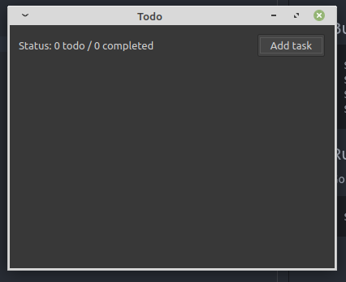
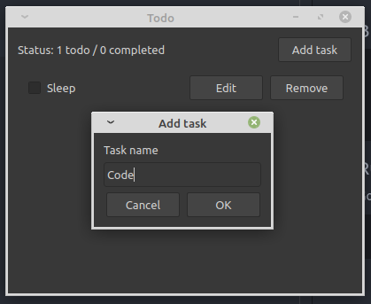

# qtodo
Todo application based on Qt framework with cmake for me to learn.

## Requirement
* Qt5 Library
* Qt Creator
* Cmake
* Visual Studio Code

## Build
```sh
$ mkdir build
$ cd build
$ cmake ..
$ make
```

## Run
Go into build folder.
```sh
$ ./qtodo
```

## Screenshot


